<div align="center">
  

# workflow-claude-supervisor

[](https://www.apple.com/macos/)
[](https://claude.ai/code)
[](https://github.com/nikitabobko/AeroSpace)
[](LICENSE)

**🧙‍♂️ Supervise multiple Claude Code instances in parallel — switch contexts instantly, get notified when tasks complete, stay in control**

[Quick Start](#quick-start) · [The Workflow](#the-workflow) · [Components](#components)

</div>

## Overview

Running one Claude Code session is straightforward. Running *several* in parallel — each working on a different project — quickly becomes chaos. Which task finished? Which window was that? Where did I leave off?

**workflow-claude-supervisor** solves this by turning you into a supervisor of AI coding agents:

- **Parallel execution** — Run 5, 6, or more Claude Code instances simultaneously
- **Instant context switching** — Jump between projects with a single keystroke
- **Task completion alerts** — Get notified the moment Claude needs your attention
- **Zero cognitive overhead** — Each project lives in its own dedicated space

Instead of babysitting one session, you delegate tasks, switch away, and return when notified. This is the supervisor pattern.

## The Workflow

```mermaid
graph LR
    subgraph You["🧙 You (Supervisor)"]
        Review["Review & Direct"]
    end

    subgraph Agents["Claude Code Instances"]
        A1["Project A"]
        A2["Project B"]
        A3["Project C"]
    end

    Review -->|"Alt+2"| A1
    Review -->|"Alt+3"| A2
    Review -->|"Alt+4"| A3

    A1 -->|"🔔 Done!"| Review
    A2 -->|"🔔 Needs input"| Review
    A3 -->|"⏳ Working..."| Review
```



### The Supervisor Pattern

1. **Delegate** — Give Claude Code a task and switch away (`Alt+3` to Project B)
2. **Multiplex** — Work on another project while the first one runs
3. **Get notified** — Desktop alert when Claude finishes or needs permission
4. **Context switch** — Click notification or press `Alt+2` to jump back instantly
5. **Review & repeat** — Check output, give next task, switch to another project

This turns waiting time into productive time. While Claude thinks through a complex refactor in Project A, you're reviewing changes in Project B and delegating tests in Project C.

### Workspace Layout

| Workspace | Keybinding | Purpose |
|-----------|------------|---------|
| 1 | `Alt+1` | Browser, notes, documentation |
| 2-9 | `Alt+2` - `Alt+9` | One Claude Code instance per workspace |

High-priority projects get lower numbers for faster access.

## Components

This workflow combines three tools, each solving a specific problem:

### 🪟 Window Management — AeroSpace

**Problem:** macOS has no native way to instantly switch between fullscreen app instances.

**Solution:** [AeroSpace](https://github.com/nikitabobko/AeroSpace) provides workspaces with instant keyboard navigation.

**Key features:**
- Alt+1-9 switches workspaces in milliseconds
- Each Cursor/VS Code window gets its own fullscreen workspace
- Auto-arrange script organizes windows by project priority
- Zero gaps, zero animations, zero distractions

### 🔔 Notifications — claude-code-notify

**Problem:** You can't watch every Claude Code instance simultaneously.

**Solution:** [claude-code-notify](https://github.com/tsilva/claude-code-notify) sends desktop notifications when Claude needs attention.

**Key features:**
- Alerts when tasks complete ("Ready for input")
- Alerts when permission is needed
- Click notification to focus the correct window (even across workspaces)
- Zero configuration required

### 📚 Skills — claude-skills

**Problem:** Keeping documentation consistent across multiple repos is tedious.

**Solution:** [claude-skills](https://github.com/anthropics/claude-skills) provides reusable skills like `readme-generator` that Claude Code can invoke across any project.

**Key features:**
- `/readme-generator` creates or updates READMEs following best practices
- `/repo-logo-generator` generates project logos with transparent backgrounds
- Skills work identically across all your supervised instances
- Consistent documentation quality without manual effort

**Workflow integration:**
As you switch between projects, use `/readme-generator` to keep each repo's documentation current. The supervisor pattern isn't just about code — it's about maintaining healthy projects across the board.

### 🔒 Sandboxed Execution — claude-sandbox

**Problem:** Permission prompts interrupt your workflow, requiring constant attention.

**Solution:** [claude-sandbox](https://github.com/tsilva/claude-sandbox) runs Claude Code with full autonomy inside an isolated container — no permission prompts, no risk to your system.

**Key features:**
- Full autonomy — Claude can install packages, run commands, modify files without prompts
- Complete isolation — Container has no access to your host system except mounted project
- Same-path mounting — File paths work identically inside and outside the container
- Per-project config — Mount additional data directories via `.claude-sandbox.json`

**Workflow integration:**
Run `claude-sandbox` instead of `claude` in your project directory. Combined with the supervisor pattern, you can delegate tasks and switch away knowing Claude will work autonomously until completion — no prompts pulling you back.

## Quick Start

### Install Window Management

```bash
git clone https://github.com/tsilva/workflow-claude-supervisor.git
cd workflow-claude-supervisor
./install.sh
```

This installs AeroSpace and configures workspaces.

### Install Notifications

```bash
git clone https://github.com/tsilva/claude-code-notify.git
cd claude-code-notify
./install.sh
```

### Install Sandboxed Execution (Optional)

```bash
git clone https://github.com/tsilva/claude-sandbox.git
cd claude-sandbox
./docker/install.sh
source ~/.zshrc
claude-sandbox login  # One-time authentication
```

Then use `claude-sandbox` instead of `claude` in any project.

### Start Supervising

1. Open Cursor/VS Code windows for each project
2. Press `Alt+C` to auto-arrange them across workspaces
3. Use `Alt+1-9` to switch between projects
4. Get notified when Claude completes tasks

## Configuration

### Project Priority

Edit `~/.config/aerospace/cursor-projects.txt` to control workspace assignment:

```
my-main-project      # Gets Alt+2 (fastest access)
api-backend          # Gets Alt+3
web-frontend         # Gets Alt+4
```

Projects listed first get lower workspace numbers.

### Configuration Files

| File | Purpose |
|------|---------|
| `~/.aerospace.toml` | AeroSpace keybindings and settings |
| `~/.config/aerospace/cursor-projects.txt` | Project priority list |
| `~/.aerospace-fix-cursor.sh` | Auto-arrange script |

## Keybindings

| Keybinding | Action |
|------------|--------|
| `Alt+1` - `Alt+9` | Switch to workspace |
| `Alt+Shift+1` - `Alt+Shift+9` | Move window to workspace |
| `Alt+C` | Auto-arrange Cursor windows by priority |
| `Alt+F` | Toggle fullscreen |
| `Alt+Left` / `Alt+Right` | Navigate to adjacent workspace |

## Requirements

- macOS
- [Homebrew](https://brew.sh)
- [Cursor](https://cursor.sh) or VS Code with Claude Code extension

## Related

- [claude-code-notify](https://github.com/tsilva/claude-code-notify) — Notifications for Claude Code
- [claude-sandbox](https://github.com/tsilva/claude-sandbox) — Isolated execution environment for Claude Code
- [claude-skills](https://github.com/anthropics/claude-skills) — Reusable skills for Claude Code
- [AeroSpace](https://github.com/nikitabobko/AeroSpace) — Tiling window manager for macOS

## License

MIT
